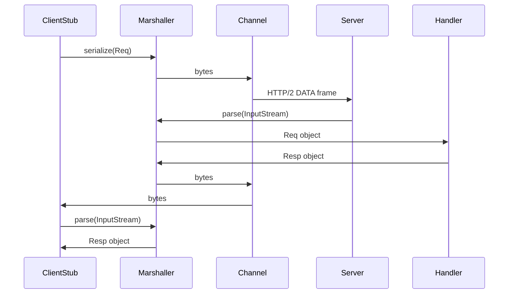
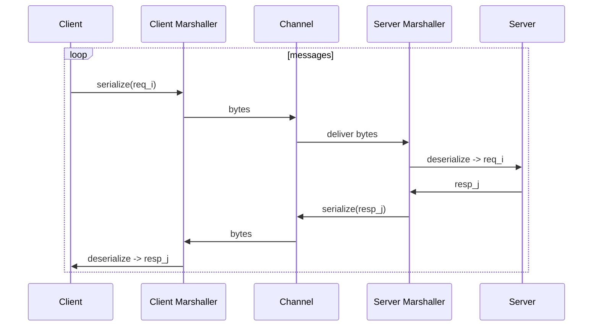

## gRPC Runtime Architecture with Protobuf and FlatBuffers

### Overview

This document explains gRPC’s runtime architecture and how it integrates with serialization frameworks, using **Protobuf** and **FlatBuffers** as concrete reference points. The goal is to inform the design of a Fory-based gRPC integration for Apache Fory, particularly in:

- Java (similar to how Protobuf and FlatBuffers integrate today)
- Python (`grpcio` with custom serializers)

We focus on request lifecycle, stub interactions, serialization triggers, memory/ownership, streaming behavior, and custom codec integration.

---

### 1. gRPC Runtime Request Lifecycle

#### 1.1 High-level flow

```mermaid
flowchart LR
  A[Client Stub] --> B[Request Serializer\n(Codec/Marshaller)]
  B --> C[gRPC Transport\nHTTP/2 Frames]
  C --> D[Server Deserializer\n(Codec/Marshaller)]
  D --> E[Service Handler\n(User Implementation)]
  E --> F[Response Serializer]
  F --> C
```

#### 1.2 Protobuf-based integration (reference)

**Java (typical stack, e.g. Google gRPC)**:

- Generated `*Grpc.java` (from `protoc` with `protoc-gen-grpc-java`):
  - Defines:
    - `MethodDescriptor<ReqT, RespT>` with:
      - `ProtoUtils.marshaller(ReqT.getDefaultInstance())`
    - `ImplBase` server base with `bindService()` using `ServerCalls.asyncUnaryCall`, etc.
    - `Stub` classes for clients.

- `ProtoUtils.marshaller` (in gRPC Java) is a **marshaller using Protobuf**:
  - `serialize(T message)` calls `message.toByteArray()`
  - `deserialize(InputStream is)` calls `T.parseFrom(InputStream)`

**Request lifecycle (Protobuf/Java)**:



#### 1.3 FlatBuffers-based integration (reference)

FlatBuffers usually integrate via **custom marshallers**:

- The request/response types often wrap a `ByteBuffer` around the incoming `byte[]`:
  - `MyTable.getRootAsMyTable(ByteBuffer)` (zero-copy read).
- The marshaller:
  - On serialize: builds a FlatBuffer and returns `byte[]`.
  - On deserialize:
    - Wraps `byte[]` into `ByteBuffer` and passes to `getRootAs…`.
    - No object allocation per field (FlatBuffers are zero-copy reads).

This pattern is analogous to how Fory can **wrap a `MemoryBuffer` or `CBuffer`** around bytes and decode without extra copying of internal data structures where possible.

---

### 2. Generated Stubs and gRPC Runtime

#### 2.1 Generated artifacts structure

**Protobuf/Java**:

- `FooGrpc.java`:

  - `FooGrpc.FooImplBase implements io.grpc.BindableService`
    - Methods: `public void myRpc(Req request, StreamObserver<Resp> responseObserver)`
    - `bindService` wires `MethodDescriptor`s and `ServerCalls.asyncUnaryCall` or streaming equivalents.

  - `FooGrpc.FooStub extends AbstractStub<FooStub>`
    - Uses `ClientCalls.unaryCall`, `blockingUnaryCall`, `asyncUnaryCall`, etc.

**FlatBuffers**:

- gRPC artifacts similar in shape; the only difference is how marshallers serialize/deserialize.

**Key pattern**:

- **Generated code is thin**:
  - Declares the service API.
  - Wires gRPC runtime (`MethodDescriptor`, `ServerCalls`, `ClientCalls`).
  - Delegates actual serialization/deserialization to a **marshaller** (codec).

---

### 3. Serialization & Deserialization Triggers

#### 3.1 Where serialization occurs

- **Client stub**:
  - For unary calls:
    - `ClientCalls.unaryCall(channel.newCall(method, callOptions), request)`
      - Triggers marshaller’s `stream(request)` / `toBytes()` for a Protobuf message.
  - For streaming:
    - On each `onNext(request)` from client code, the marshaller is invoked to turn request objects into bytes.

- **Server side**:
  - Prior to sending responses via `StreamObserver.onNext(response)`:
    - Server calls appropriate server call handler (e.g. `ServerCalls.asyncUnaryCall`), which:
      - Calls marshaller’s `stream(response)` before writing data frames.

#### 3.2 Where deserialization occurs

- **Server**:
  - Incoming data frames are aggregated by gRPC runtime.
  - Once a full message is assembled, `Marshaller.parse(InputStream)` is used to reconstruct objects (Protobuf `parseFrom` / FlatBuffers `getRootAs`).
- **Client**:
  - Similar: aggregated frames → marshaller.parse → objects delivered to `StreamObserver` or stub return values.

---

### 4. Memory Ownership and Object Lifecycle

#### 4.1 Protobuf

- **Serialization**:
  - `message.toByteArray()`:
    - Allocates a new byte array with the full message.
  - Typically no zero-copy; each message is a copy into `byte[]`.

- **Deserialization**:
  - `T.parseFrom(InputStream)`:
    - Allocates a new message object.
    - Parses internal fields, performing copies for strings, repeated fields, etc.

- **Ownership**:
  - The application fully owns objects returned by parse.
  - The runtime owns the wire `byte[]` and HTTP/2 frame buffers.

#### 4.2 FlatBuffers

- **Serialization**:
  - FlatBuffers builder creates a `ByteBuffer` with data; a `byte[]` may be returned from that buffer.
- **Deserialization**:
  - `MyTable.getRootAsMyTable(ByteBuffer buffer)`:
    - No deep copy; holds references into `ByteBuffer`.
- **Ownership**:
  - Application must ensure underlying `ByteBuffer` lives as long as the FlatBuffers objects referencing it.

---

### 5. Streaming RPC Behavior

#### 5.1 Unary

- **Protobuf / FlatBuffers**:
  - Single request → single response.
  - Marshaller invoked once per side.

#### 5.2 Client streaming

- Multiple `request.onNext()` calls each trigger marshalling.
- Server aggregates or processes streaming messages.
- Final `onCompleted` triggers server handler’s final response, marshalled once.

#### 5.3 Server streaming

- Single client request triggers server returning `onNext` multiple times.
- Each `onNext` triggers serialization.

#### 5.4 Bidirectional streaming

- Both ends send `onNext` events on their respective streams.
- Serialization/deserialization is invoked per-message, directionally symmetric.

**Pattern**:



---

### 6. Custom Codec Integration

#### 6.1 Java custom marshaller

Protobuf’s `ProtoUtils.marshaller` is just one implementation of `Marshaller<T>`. Any custom codec (e.g., Fory) follows the same pattern:

```java
public final class ForyMarshaller<T> implements MethodDescriptor.Marshaller<T> {
    private final Class<T> clazz;
    private final org.apache.fory.ThreadSafeFory fory;

    @Override
    public InputStream stream(T value) {
        byte[] bytes = fory.serialize(value);
        return new ByteArrayInputStream(bytes);
    }

    @Override
    public T parse(InputStream stream) {
        byte[] bytes = readAllBytes(stream);
        return fory.deserialize(bytes, clazz);
    }
}
```

- With additional optimization:
  - Use gRPC’s `InputStream` wrappers that can avoid extra copies.
  - Integrate directly with `MemoryBuffer` for minimal overhead.

#### 6.2 Python custom codec

In `grpcio`:

- Request/response serializer/deserializer signatures:

```python
channel.unary_unary(
    "/Service/Method",
    request_serializer=lambda obj: bytes,
    response_deserializer=lambda b: obj,
)
```

- Custom Fory codec:

```python
class ForyCodec:
    def __init__(self, get_fory):
        self._get_fory = get_fory

    def serialize(self, cls):
        def _ser(obj):
            return self._get_fory().serialize(obj)
        return _ser

    def deserialize(self, cls):
        def _des(b):
            return self._get_fory().deserialize(b, cls)
        return _des
```

This is analogous to how Protobuf’s Python integration uses `message.SerializeToString()` and `cls.FromString()`.

---

### 7. Where Zero-Copy is Achievable vs Constrained

#### 7.1 Achievable

- **FlatBuffers**:
  - Immediate zero-copy for reads from `ByteBuffer` once bytes are in memory.
- **Fory (design) analogues**:
  - If gRPC can provide a `ByteBuffer` or a zero-copy `ByteBuf` (Netty), Fory could:
    - Wrap it in `MemoryBuffer` or `CBuffer` without copying content.
    - Read fields directly into objects (or row format base objects).

- **Row format / direct buffer access**:
  - With Fory row format, storing decoded row objects that still reference underlying buffer can achieve a similar effect to FlatBuffers.

#### 7.2 Constrained

- **Network stack**:
  - gRPC implementations generally assemble messages in their own buffers; user code sees `byte[]`/`ByteBuffer`/`bytes` abstractions.
- **gRPC API contracts**:
  - Java `Marshaller<T>` operates on `InputStream`, not arbitrarily on `ByteBuf`.
  - Python `grpcio` requires `bytes` for payloads.
- **Safety & lifecycle**:
  - Even when referencing shared `ByteBuffer`s, care must be taken to ensure they outlive the decoding objects.

Thus, **zero-copy** is mainly achievable **inside** the serialization framework once bytes are available, not necessarily from NIC → application without copies.

---

### 8. Protobuf vs FlatBuffers vs Fory (implications for Fory design)

#### 8.1 Protobuf-style (deep copy) vs FlatBuffers-style (zero-copy)

- **Protobuf**:
  - Simpler semantics; object graphs independent of wire buffer.
  - Cost: more allocations and copies.

- **FlatBuffers**:
  - High performance, zero-copy reads.
  - Constraints: objects must not outlive underlying buffer; random-access field reads.

- **Fory**:
  - Already implements both:
    - Object graph format (xlang, like Protobuf with references and schema meta).
    - Row format (like FlatBuffers/Arrow for random-access, zero-copy-ish).
  - gRPC design can:
    - For initial version: emulate **Protobuf-style** integration (full object reconstruction).
    - Later: add row-format-based handlers for **FlatBuffers-style** zero-copy flows.

#### 8.2 Applying to Apache Fory gRPC integration

- **Short term (GSoC scope)**:
  - Implement **Protobuf-like** integration:
    - Generate service APIs and stubs (Java/Python).
    - Use object-graph xlang serialization via `Fory.serialize`/`deserialize`.
    - Keep design open for future row-format streaming.

- **Long term**:
  - Introduce optional **row-based wire format** for gRPC:
    - Service methods that return row-format views or columnar results.
    - Align with `java/fory-format` and `python/pyfory/format`.

---

### 9. Summary

- gRPC’s runtime architecture centers around:
  - **Generated service and stub code** that is mostly wiring.
  - A **serialization codec** (marshaller) pluggable per method.
- Protobuf and FlatBuffers illustrate two ends of the spectrum:
  - Protobuf: deep-copy, object-centric; easy but less zero-copy.
  - FlatBuffers: buffer-centric; zero-copy, but lifecycle-sensitive.
- For Apache Fory:
  - We will **mirror Protobuf’s integration pattern**:
    - Generate `*Grpc.java` / `*_grpc.py` wrappers.
    - Use Fory-based marshallers/codecs in Java and Python.
  - We can later approach FlatBuffers-level zero-copy by:
    - Leveraging row format and tighter integration with transport buffers.

This understanding feeds directly into the **Fory gRPC integration design** (Document 1), ensuring the implementation fits gRPC’s architecture 
while leveraging Fory’s existing serialization and zero-copy capabilities.


flowchart LR
  A[User / Generated Java Model] --> B[ThreadSafeFory\n(from XxxForyRegistration)]
  B --> C[Fory.serialize(obj)]
  C --> D[RefResolver.writeRefOrNull]
  D --> E[TypeResolver.getTypeInfo + writeTypeInfo]
  E --> F[Serializer.write(buffer, obj)]
  F --> G[MemoryBuffer.toByteArray()\nSerialized Payload]
