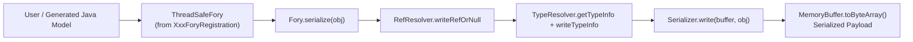
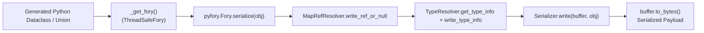
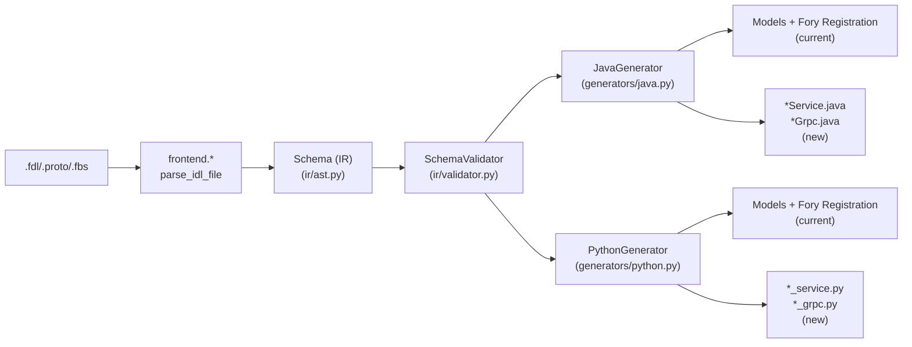
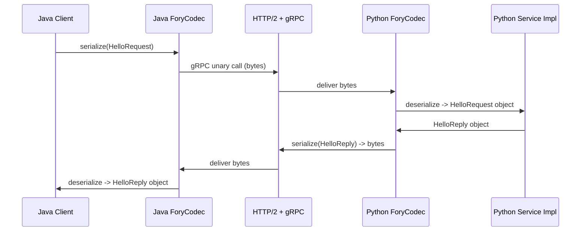
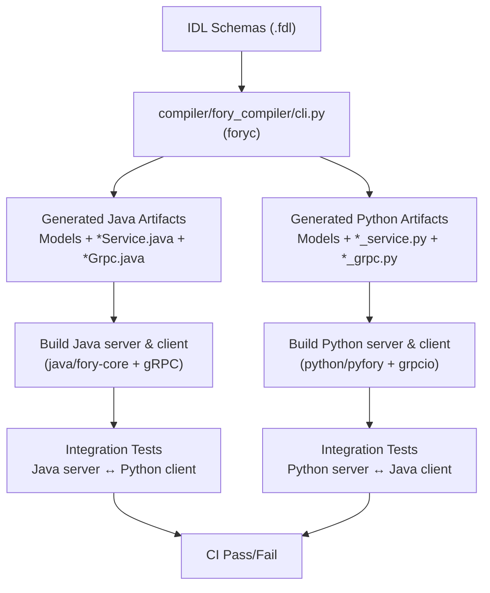

## Apache Fory Java & Python gRPC Integration Design

### Overview

This document proposes an end-to-end design for adding **Java and Python gRPC integration** to Apache Fory using only Fory’s serialization formats (no protobuf payloads).The gRPC transport layer (HTTP/2, service routing, streaming semantics) remains unchanged; only the message serialization layer is replaced with Fory instead of protobuf.
The design is based on:

- The existing **compiler pipeline** in `compiler/fory_compiler/**`
- The **Java runtime** in `java/fory-core/**` (plus `fory-format` as needed)
- The **Python runtime** in `python/pyfory/**`
- Existing IDL support for `service`/`rpc` in the compiler IR

It targets the following artifacts:

- **Java**: `*Service.java`, `*Grpc.java`
- **Python**: `*_service.py`, `*_grpc.py`

With requirements:

- Fory serialization only
- Unary + streaming RPCs
- Cross-language interop:
  - Java server ↔ Python client
  - Python server ↔ Java client
- Zero-copy decoding where possible, with fallbacks
- CI round-trip interoperability tests

---

### 1. Existing Architecture (Compiler & Runtimes)

#### 1.1 Compiler pipeline

**Key modules (all under `compiler/fory_compiler/`)**:

- **CLI & orchestration**: `cli.py`
  - Entry: `main()` / `compile_file()` / `compile_file_recursive()`
  - Uses `frontend.utils.parse_idl_file()` to parse `.fdl`, `.proto`, `.fbs`
  - Merges imports into a unified `Schema` IR
  - Runs `SchemaValidator` (`ir/validator.py`)
  - Dispatches to `GENERATORS[lang]` (`generators/__init__.py`)

- **IDL parsing**:
  - FDL:
    - `frontend/fdl/lexer.py` (`Lexer`)
    - `frontend/fdl/parser.py` (`Parser.parse() -> Schema`)
  - Protobuf / FlatBuffers:
    - `frontend/proto/**`, `frontend/fbs/**`
  - Dispatch:
    - `frontend/utils.py::parse_idl_file(path)`

- **IR definition**:
  - `ir/ast.py`:
    - `Schema`, `Message`, `Enum`, `Union`, `Service`, `RpcMethod`, `Field`, `Import`, etc.
  - `ir/types.py`: `PrimitiveKind`, `PRIMITIVE_TYPES`
  - `ir/validator.py`: `SchemaValidator`
  - `ir/emitter.py`: `FDLEmitter` (for `--emit-fdl`)

- **Code generation**:
  - Base: `generators/base.py` (`BaseGenerator`, `GeneratorOptions`, `GeneratedFile`)
  - Java: `generators/java.py` (`JavaGenerator`)
    - Generates POJOs, union classes, `XxxForyRegistration`
  - Python: `generators/python.py` (`PythonGenerator`)
    - Generates `@pyfory.dataclass` models, union types, `register_*_types`, `_get_fory()`

**Current gap**: Services are already part of IR (`Service`, `RpcMethod` in `ir/ast.py`), but there is **no generator** for Java/Python gRPC artifacts.

---

#### 1.2 Java runtime architecture

**Core packages (under `java/fory-core/src/main/java/org/apache/fory/`)**:

- `Fory.java`
  - Main serialization/deserialization engine
  - Builder-wired `Config` (xlang/native, ref tracking, meta sharing, etc.)
  - Methods:
    - `serialize(Object)`, `serialize(MemoryBuffer, Object)`
    - `deserialize(byte[])`, `deserialize(MemoryBuffer, Class<T>)`, etc.
  - Uses `RefResolver`, `TypeResolver`, `SerializationContext`, `MetaStringResolver`, `MemoryBuffer`

- `resolver/TypeResolver.java` (and related)
  - Maps `Class<?>` ↔ `TypeInfo` (type IDs, `Serializer<?>`, schema meta)
  - `register`, `registerUnion`, `writeTypeInfo`, `readTypeInfo`
  - Bridges **internal type IDs** and **user type IDs** with Fory protocol

- `serializer/*`
  - Primitive and composite serializers
  - `ObjectSerializer`, `GeneratedObjectSerializer`, `GeneratedMetaSharedSerializer`, `UnionSerializer`, etc.

- `codegen/*`, `builder/*`
  - Expression-based JIT serializers
  - `JITContext`, `CodegenSerializer`

- Buffer & util (exact file names may vary):
  - `MemoryBuffer` (under `util`/`io`)
  - Varint encoding, string encoding, bit operations, buffer pooling

**Serialization lifecycle (Java)**:
Generated code typically uses a `ThreadSafeFory` instance (from `XxxForyRegistration`) to ensure thread-safe serialization contexts when used inside multi-threaded RPC servers.



**Deserialization lifecycle (Java)**:


**Zero-copy & buffer handling**:

- `MemoryBuffer` reuses internal `byte[]` where possible
- Out-of-band buffers for large blobs:
  - xlang header bit indicates out-of-band data
  - `Fory.deserialize` can take `Iterable<MemoryBuffer>` so data can remain separate
- Row format (`java/fory-format/**`) and SIMD (`java/fory-simd/**`) offer additional high-performance, cache-friendly pathways when used

---

#### 1.3 Python runtime architecture

**Key modules (under `python/pyfory/`)**:

- Pure Python engine:
  - `_fory.py`
    - `class Fory`: pure-Python serializer
  - `registry.py`
    - `class TypeResolver`: Python type registry & type info
  - `serializer.py`
    - Serializer hierarchy for primitives, collections, structs, unions
  - `resolver.py`
    - `MapRefResolver` for reference tracking
  - `buffer.py` / `buffer.pyx`
    - Buffer abstraction, varint/string encoding

- Cython engine:
  - `serialization.pyx`
    - `class Fory`: Cython-backed serializer
  - `buffer.pxi`, C++ includes under `includes/`
    - `CBuffer`-based buffer, `TypeId` helpers, etc.

**Serialization lifecycle (Python)**:



**Deserialization lifecycle (Python)**:


**Zero-copy & buffer handling**:

- Out-of-band semantics similar to Java:
  - Header flags + buffer objects (`BytesBufferObject`, `NDArrayBufferObject`, etc. in `serializer.py`)
- Cython engine uses C++ `CBuffer` for performance
- Numpy / `memoryview`-based serializers can **avoid copying** array data

---

#### 1.4 Cross-language compatibility points (Java ↔ Python)

- Shared protocol spec:
  - `docs/specification/xlang_serialization_spec.md`
  - `docs/specification/xlang_type_mapping.md`
- Consistent type IDs:
  - Java: `org.apache.fory.type.Types`
  - Python: `pyfory.TypeId` (and associated constants)
- Same xlang header bits, reference flags, meta string encoding, TypeDef (schema meta)
- Compiler-generated Java and Python code:
  - Based on **same IR** (`compiler/fory_compiler/ir/ast.py`)
  - Uses **same type IDs and schema options** from FDL/FDL-compatible inputs
- Integration tests in `integration_tests/idl_tests/**` already verify cross-language struct/union round-trips; gRPC tests will layer on top.
  
-Compatibility across languages also relies on Fory’s schema evolution rules defined in the cross-language specification, allowing backward-compatible changes such as adding optional fields while preserving wire compatibility.

---

#### 1.5 Logical integration points for gRPC

**Compiler side (`/compiler`)**:

- IR already has:
  - `Service`, `RpcMethod` in `ir/ast.py`
- Place to extend:
  - `generators/java.py`:
    - Add generation for `*Service.java` and `*Grpc.java`
  - `generators/python.py`:
    - Add generation for `*_service.py` and `*_grpc.py`
- Additional configuration:
  - File-level or service-level options in FDL:
    - e.g. `option java_grpc_package = "..."`, `option python_grpc_module = "..."`

**Java runtime side (`/java`)**:

- Integration point:
  - gRPC server: custom `Marshaller`/`MethodDescriptor` using `Fory` instead of protobuf
  - gRPC client: same `Marshaller` usage and generated stubs
- Potential new package:
  - `org.apache.fory.grpc` in `java/fory-core` or a new submodule (e.g. `java/fory-grpc`)
  -To avoid introducing a gRPC dependency into the core serialization runtime, the gRPC integration may be implemented as a separate module (for example `java/fory-grpc`) rather than inside `fory-core`.

**Python runtime side (`/python`)**:

- Integration point:
  - gRPC Python (`grpcio`) custom `Codec` / `CallCredentials` / `GenericRpcHandler` with Fory bytes
- Potential module:
  - `pyfory.grpc` (new module) for shared codec utilities

---

### 2. Proposed Compiler Extensions for gRPC

#### 2.1 Compiler pipeline with service generation



**Changes in `generators/java.py`**:

- For each `Service` in `Schema`:
  - Generate:
    - `FooService.java`: **user-implementable service interface**
    - `FooGrpc.java`: **gRPC binding + factory**

**Changes in `generators/python.py`**:

- For each `Service`:
  - Generate:
    - `foo_service.py`: **user-implementable service base class / ABC**
    - `foo_grpc.py`: **gRPC server + stub helpers**

FDL example (conceptual):

```fdl
service Greeter {
  rpc SayHello(HelloRequest) returns (HelloReply);
  rpc LotsOfReplies(HelloRequest) returns (stream HelloReply);
  rpc LotsOfGreetings(stream HelloRequest) returns (HelloReply);
  rpc BidiHello(stream HelloRequest) returns (stream HelloReply);
}
```

The IR already captures streaming information (or can be extended minimally).

---

#### 2.2 Generated Java API surface

**Target package**: `org.example.generated` (from FDL `package` / `java_package`)

1. **Service interface** – `GreeterService.java`

```java
public interface GreeterService {

    // Unary
    HelloReply sayHello(HelloRequest request, io.grpc.Context context);

    // Server streaming
    void lotsOfReplies(
        HelloRequest request,
        org.apache.fory.grpc.ForyStreamObserver<HelloReply> responseObserver,
        io.grpc.Context context);

    // Client streaming
    org.apache.fory.grpc.ForyStreamObserver<HelloRequest> lotsOfGreetings(
        org.apache.fory.grpc.ForyStreamObserver<HelloReply> responseObserver,
        io.grpc.Context context);

    // Bidi streaming
    org.apache.fory.grpc.ForyStreamObserver<HelloRequest> bidiHello(
        org.apache.fory.grpc.ForyStreamObserver<HelloReply> responseObserver,
        io.grpc.Context context);
}
```

2. **gRPC binding** – `GreeterGrpc.java`

```java
public final class GreeterGrpc {
    public static final String SERVICE_NAME = "example.Greeter";

    // Marshaller built on Fory
    private static final io.grpc.MethodDescriptor<HelloRequest, HelloReply> METHOD_SAY_HELLO =
        org.apache.fory.grpc.ForyDescriptors.unaryMethod(
            SERVICE_NAME,
            "SayHello",
            HelloRequest.class,
            HelloReply.class);

    // Additional MethodDescriptors for streaming rpcs...

    public static abstract class GreeterImplBase implements io.grpc.BindableService {
        public void sayHello(
            HelloRequest request,
            io.grpc.stub.StreamObserver<HelloReply> responseObserver) {
            // default UNIMPLEMENTED
            io.grpc.stub.ServerCalls.asyncUnimplementedUnaryCall(
                METHOD_SAY_HELLO, responseObserver);
        }

        // streaming default methods...

        @Override
        public final io.grpc.ServerServiceDefinition bindService() {
            return io.grpc.ServerServiceDefinition
                .builder(SERVICE_NAME)
                .addMethod(
                    METHOD_SAY_HELLO,
                    org.apache.fory.grpc.ForyServerCalls.unary(
                        this::sayHello,
                        HelloRequest.class,
                        HelloReply.class))
                // add other methods...
                .build();
        }
    }

    public static final class GreeterStub extends io.grpc.stub.AbstractStub<GreeterStub> {
        // uses ForyClientCalls with Fory-based marshaller
    }
}
```

3. **Runtime support classes** (proposed new package `org.apache.fory.grpc`):

- `ForyMarshaller<T>`
  - Implements `io.grpc.MethodDescriptor.Marshaller<T>`
  - Uses `ThreadSafeFory` configured for the IDL module (through generated registration).

- `ForyDescriptors`
  - Helpers for building `MethodDescriptor` instances for unary/streaming.

- `ForyServerCalls`, `ForyClientCalls`
  - Analogous to `io.grpc.stub.ServerCalls` / `ClientCalls`, but parameterized with Fory marshallers and providing zero-copy-friendly hooks.

---

#### 2.3 Generated Python API surface

Assume standard `grpcio` (v1) usage.

1. **Service base** – `greeter_service.py`

```python
import abc
from typing import AsyncIterator, Iterator
import pyfory

from .hello_models import HelloRequest, HelloReply  # generated dataclasses


class GreeterService(abc.ABC):
    """User-implemented service base class."""

    # Unary
    @abc.abstractmethod
    async def SayHello(self, request: HelloRequest, context) -> HelloReply:
        ...

    # Server streaming
    @abc.abstractmethod
    async def LotsOfReplies(
        self, request: HelloRequest, context
    ) -> AsyncIterator[HelloReply]:
        ...

    # Client streaming
    @abc.abstractmethod
    async def LotsOfGreetings(
        self, request_iter: AsyncIterator[HelloRequest], context
    ) -> HelloReply:
        ...

    # Bidi streaming
    @abc.abstractmethod
    async def BidiHello(
        self, request_iter: AsyncIterator[HelloRequest], context
    ) -> AsyncIterator[HelloReply]:
        ...
```

2. **gRPC wiring** – `greeter_grpc.py`

```python
import grpc
import pyfory

from . import greeter_service
from .hello_models import HelloRequest, HelloReply
from .hello_models import _get_fory as _get_hello_fory  # generated


class ForyGreeterServicer(greeter_service.GreeterService):
    """Adapter base implementing grpc Servicer interface using Fory codec."""

    # This class may remain abstract; concrete implementations subclass it.


def add_GreeterServicer_to_server(servicer: greeter_service.GreeterService, server: grpc.Server):
    codec = pyfory.grpc.ForyCodec(_get_hello_fory)

    rpc_method_handlers = {
        "SayHello": grpc.unary_unary_rpc_method_handler(
            _wrap_unary(servicer.SayHello, codec, HelloRequest, HelloReply),
            request_deserializer=codec.deserialize(HelloRequest),
            response_serializer=codec.serialize(HelloReply),
        ),
        # ... streaming handlers ...
    }

    generic_handler = grpc.method_handlers_generic_handler(
        "example.Greeter", rpc_method_handlers
    )
    server.add_generic_rpc_handlers((generic_handler,))


class GreeterStub:
    """Client stub using Fory serialization."""
    def __init__(self, channel: grpc.Channel):
        self._codec = pyfory.grpc.ForyCodec(_get_hello_fory)
        self._channel = channel

    def SayHello(self, request: HelloRequest, timeout=None, metadata=None) -> HelloReply:
        return self._channel.unary_unary(
            "/example.Greeter/SayHello",
            request_serializer=self._codec.serialize(HelloRequest),
            response_deserializer=self._codec.deserialize(HelloReply),
        )(request, timeout=timeout, metadata=metadata)
```

3. **Runtime support (`pyfory.grpc`)**:

- `class ForyCodec:`
  - Holds `ThreadSafeFory` factory for the IDL module.
  - Provides `serialize(cls) -> Callable[obj -> bytes]` and `deserialize(cls) -> Callable[bytes -> obj]`.
  - For streaming:
    - `iter_serialize` / `iter_deserialize` helpers to integrate with generator- and async-iterator-based handlers.

---

### 3. gRPC Request Lifecycle with Fory

#### 3.1 High-level lifecycle (cross-language)



For streaming calls, the same pipeline is just repeated per message in each direction.

#### 3.2 Serialization boundaries

- **Java**:
  - Generated stubs call:
    - `ForyMarshaller<T>.stream(T)` / `parse(InputStream)` internally, implemented using `Fory.serialize` / `Fory.deserialize`.
  - Boundary:
    - Between **Java objects** (generated models) and **`byte[]` payloads** in gRPC frame.

- **Python**:
  - Generated stubs and server handlers call:
    - `ForyCodec.serialize(cls)(obj)` / `ForyCodec.deserialize(cls)(bytes)`.
  - Boundary:
    - Between **Python dataclasses** and **`bytes`** for gRPC.

---

### 4. Zero-copy Feasibility and Fallbacks

#### 4.1 Java

- **Feasible**:
  - Reuse `MemoryBuffer` and underlying `byte[]` to avoid copies.
  - Zero-copy into application for certain large types if:
    - `Fory` uses **out-of-band buffers** and returns references by wrapping them without copying.
  - Potential extension: gRPC **unsafe** optimizations using Netty’s `ByteBuf` and Fory decoders that read directly from `ByteBuf` (advanced).

- **Constraints**:
  - gRPC Java’s `Marshaller` API typically deals with `InputStream` and `byte[]`:
    - We must at least materialize a contiguous `byte[]` for the message.
  - Zero-copy is mostly limited to:
    - Avoiding extra copies *inside* Fory.
    - Sharing underlying buffers with application code where safe.

- **Fallbacks**:
  - If zero-copy cannot be obtained (most typical cases), fallback is:
    - `Fory.serialize` → copy to byte[] → gRPC writes.
    - On read, `byte[]` from gRPC → wrap in `MemoryBuffer` → `Fory.deserialize`.

#### 4.2 Python

- **Feasible**:
  - With `serialization.pyx` + C++ `CBuffer`:
    - Efficient copying into Python `bytes`.
  - For **large arrays** / numpy:
    - Use `NDArrayBufferObject` and similar constructs to hold data without copying.
    - However, gRPC Python still expects `bytes` on the wire.

- **Constraints**:
  - Python `grpcio` interface is `bytes`-based for messages.
  - True zero-copy from network to Python objects is hard:
    - You must at least read from `socket` into some buffer.

- **Fallbacks**:
  - Standard path:
    - `ForyCodec.serialize`: `Fory.serialize(obj) -> bytes`.
    - `ForyCodec.deserialize`: `Fory.deserialize(bytes) -> obj`.

---

### 5. CI Structure for Interoperability

#### 5.1 Test topology

We will extend `integration_tests` with a new module, e.g. `integration_tests/grpc_xlang_tests`:

- **Tests**:

  1. **Java server ↔ Python client (unary + streaming)**:
     - Start Java gRPC server (using generated `*Grpc.java`) with Fory codec.
     - Python test code:
       - Use generated `*_grpc.py` stub to call unary, server streaming, client streaming, bidi streaming.
     - Verify payloads and behavior.

  2. **Python server ↔ Java client (unary + streaming)**:
     - Start Python gRPC server with generated `*_service.py` + `*_grpc.py`.
     - Java test code:
       - Use generated Java stub in `*Grpc.java`.

  3. **IDL-driven round-trip**:
     - Use canonical `.fdl` in `integration_tests/idl_tests` for messages and services.
     - Compile to both Java and Python.
     - Run tests via Maven (`java`) and Python (`pytest`) orchestrated by a shell script or Maven profile.

#### 5.2 CI diagram



- Hooks:
  - Maven profile in `java/pom.xml` to run gRPC xlang tests.
  - Python `pytest` tests under `integration_tests/grpc_xlang_tests/python`.
  - Combined driver script under `integration_tests/grpc_xlang_tests/run.sh`.

---


### Error Handling

Serialization or deserialization failures must be translated into appropriate gRPC status errors.

Typical mappings include:

- Serialization failures → `Status.INTERNAL`
- Invalid payload format → `Status.INVALID_ARGUMENT`
- Schema or type mismatch → `Status.FAILED_PRECONDITION`

This ensures that serialization failures propagate through the gRPC error model while preserving observability for clients.

---

### 6. Implementation Strategy Summary

1. **Extend IR and validation (if needed)**:
   - Ensure `Service`/`RpcMethod` supports:
     - Streaming flags (client/server/bidi).
     - Fory-specific options (e.g. service name, package overrides).

2. **Extend Java generator** (`compiler/fory_compiler/generators/java.py`):
   - For each `Service`:
     - Emit `*Service.java` interface.
     - Emit `*Grpc.java` with:
       - `MethodDescriptor`s using `ForyMarshaller`.
       - `ImplBase` and `Stub` types.

3. **Extend Python generator** (`compiler/fory_compiler/generators/python.py`):
   - For each `Service`:
     - Emit `*_service.py` base class.
     - Emit `*_grpc.py` integration with `grpcio` using `pyfory.grpc.ForyCodec`.

4. **Add runtime grpc support**:
   - Java: new `org.apache.fory.grpc` package with:
     - `ForyMarshaller`, `ForyDescriptors`, `ForyServerCalls`, `ForyClientCalls`.
   - Python: new `pyfory.grpc` module with:
     - `ForyCodec` and helpers for streaming.

5. **Add CI integration tests**:
   - New `integration_tests/grpc_xlang_tests` module.
   - Scripts to compile IDL, start Java server, run Python client tests, and vice versa.

This yields a cohesive, cross-language gRPC layer that remains **fully Fory-native** while aligning with existing gRPC usage patterns and Fory’s runtime design.

---

